# 第一回 git講座 (後半)
後半では開発側の視点からgitを利用したバージョン管理を体験してもらいます。
前半で見つけてもらった文章の間違いをバージョン管理をしながら修正していきます。

今回は最初の2文を修正してみましょう。

1. 物置の隅で、ほこり<font color="red">ぐるみ</font>になっている古い人形を見つけた。
2. その選手は、十年に一人の<font color="red">玄人</font>だと言われている。
3. 私は、この土地で定職に就き、生活の根源を築いた。
4. 議論は難航すると思ったが、すぐに意見がまとまりうっとりと結論が出た。
5. 市長の責任ある行動が住民の不安を削除し、行政に対する期待が一気に高まった。
6. 十分に煮た野菜は味が潤って柔らかく、とてもおいしかった。
7. このテーブルは、私が子供の頃から使っているので、好感があって捨てられない。
8. 医学だけでなく、法学にも詳しいのが彼の重みだ。


## 目次

1. 準備
2. add & commitを使ったセーブ
3. 過去のバージョンに戻す
4. GitHubへの変更の反映


## 1. 準備

### 1.1 リポジトリのコピー(fork)
実際の開発では、前半で使用したリポジトリに全員で編集を行いますが、
今回は各々でリポジトリをコピーして編集していきます。

1. ブラウザから前半で使用した[ページ](https://github.com/OmeSatoFoundation/Github_Practice)を開いてください
2. 右上のforkボタンを押します。
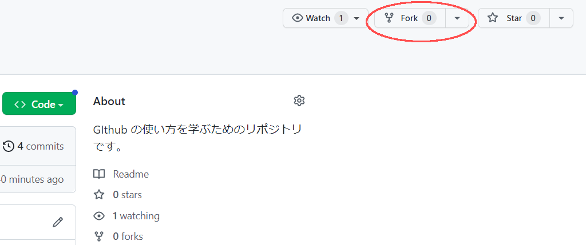
3. `Create fork`ボタンを押します。
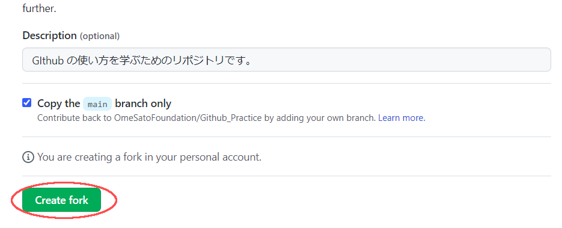

左上の名前が自身のアカウント名に変わっていたら、コピー完了です。
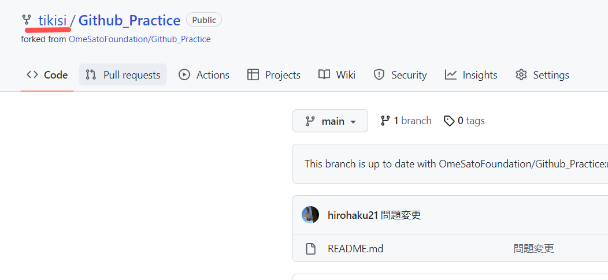


### 1.2 鍵の登録

鍵を作成、登録しておくことでGitHubと安全に通信することができます。

ターミナル上で鍵を作成しコピーします。

```bash
# 鍵の作成  (コマンド実行後、Enterを３回ぐらい押す必要があります。)
ssh-keygen -t rsa

# 公開鍵のコピー(windowsの人)
cat ~/.ssh/id_rsa.pub | clip.exe
# 公開鍵のコピー(macの人)
cat ~/.ssh/id_rsa.pub | pbcopy
# 公開鍵のコピー(ラズパイの人)
sudo apt-get install xsel
cat ~/.ssh/id_rsa.pub | xsel --clipboard --input
```

次にhttps://github.com/settings/keysにアクセスして鍵を登録します。

1. `New SSH key`ボタンを押します。
   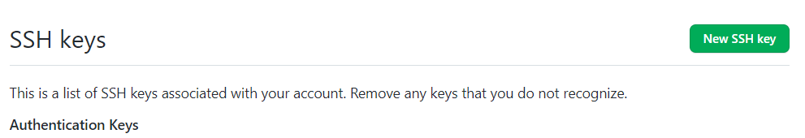
2. Titleに好きな名前を記入
3. Keyの欄に先ほどコピーした鍵を貼り付けます。(Ctrl-v or Cmd-v)
4. 最後に`Add SSH key`ボタンを押して完了です。
   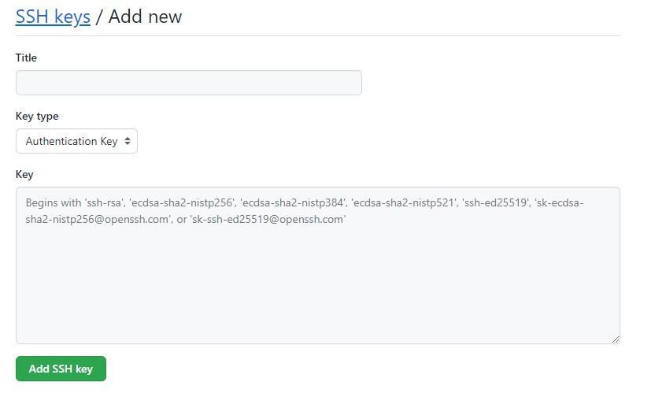

##### 鍵についての補足

`ssh-keygen -t rsa`によって秘密鍵(id_rsa)と公開鍵(id_rsa.pub)が生成されます。

```bash
# 鍵の確認方法
ls ~/.ssh

# 実行結果: id_rsa id_rsa.pub
```

GitHubに登録したものは公開鍵です。
GitHub登録された公開鍵に対応する秘密鍵を持っている人のみがアクセスが可能になり、それ以外の人は弾くことで安全性を確保しています。

- 秘密鍵は他の人に見せたりしないでください。
  - 他の人が不正にアクセスできるようになってしまいます。
- 一台のコンピュータで鍵の生成`ssh-keygen-t rsa`は一度だけでよいです。
  - 再度生成した場合は、再度GitHubへの公開鍵の登録が必要になります。


### 1.3 リポジトリのclone

文章を自身のコンピュータで編集できるようにするため、自身のコンピュータに先ほどコピーしたリポジトリを持ってきます。このことを`clone`と呼びます

1. コピー後のリポジトリで`<>Code`ボタンを押します
2. SSHを選択します
3. リンクをコピーしてください。
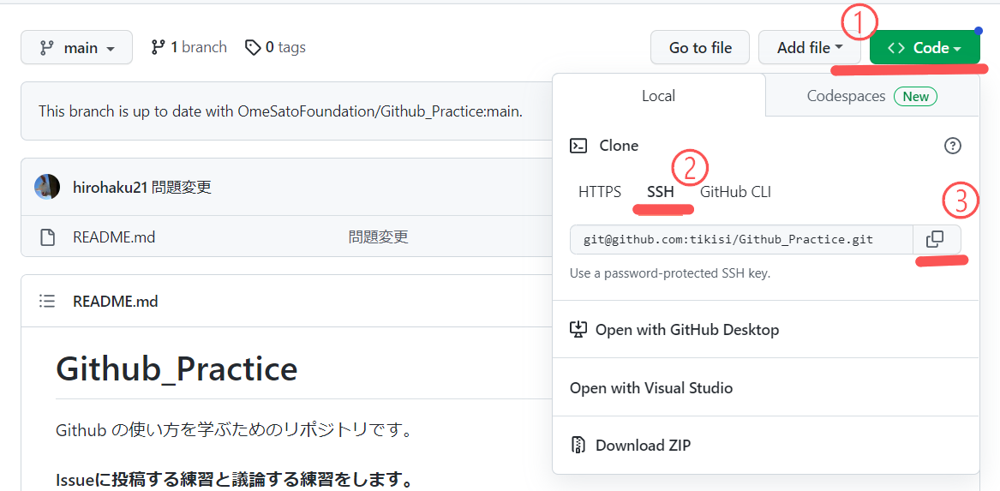
4. 自身のコンピュータでターミナルを開きましょう
    1. Windows:  Git Bash
    2. Mac & ラズパイ: ターミナル
4. コピーしたリンクを使ってリポジトリをCloneします
    ```bash
    git clone コピーしたリンク
    ```
    GitBashの人は`Shift-Insert`でコピーしたリンクを貼り付けられます。
5. `cd Github_Practice`で移動し、再度`ls`で`README.md`が存在することを確認してください


### 1.4 git config

名前とメールアドレスを以下のコマンドで設定できます.

GitHubに登録したものと同じものを登録してください。
```bash
git config --global user.name 名前
git config --global user.email メールアドレス
```


## 2. add & commitを使ったセーブ

### 2.1 ファイルの編集
1. `README.md`を編集するためにエディタを開きます。
   
    1. Windows: `notepad.exe README.md`
    2. Mac: `open README.md`
    3. ラズパイ: `leafpad README.md`
    
2. 1文目を修正します。
   
    ```txt
    (編集前) 1. 物置の隅で、ほこりぐるみになっている古い人形を見つけた。
    (編集後) 1. 物置の隅で、ほこりまみれになっている古い人形を見つけた。
    ```
3. `Ctrl-S`などでセーブ後、**エディタを閉じてください**


### 2.2 git status

`git status`コマンドはリポジトリの状態を確認できます。

コミットツリーに記録されていない変更があれば、表示してくれます。

```bash
git status
```

`README.md`が変更されたことはコミットツリーに記録されていないので、**赤色**で表示されます。

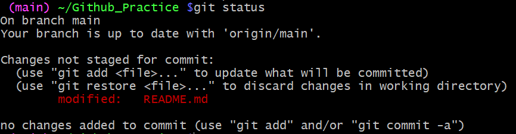


### 2.3 git add

`README.md`を変更したことをリポジトリにセーブしましょう。

まずは、インデックスに追加していきます。

`git add ファイル名`コマンドは引数に渡したファイルをインデックスに追加します。

```bash
git add README.md
```

statusを確認してみると、インデックスに追加されたため**緑色**で表示されます

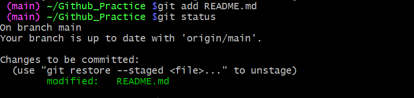

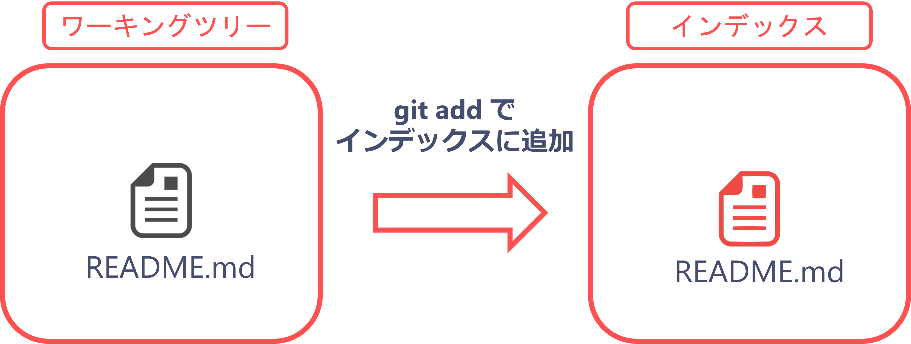


### 2.4 git commit

インデックスに追加できたので今度はコミットツリーに記録します。

記録する履歴のことを**コミット**といいます。

また、何の変更をしたのか後で分かるようにコメントを残す必要があります。

このコメントを**コミットメッセージ**といいます。

`git commit -m "コミットメッセージ"`コマンドはインデックスに登録された変更をコミットツリーに記録します。また、mオプションをつけることでコミットメッセージを書くことができます。

```bash
git commit -m "一つ目の文章を修正"
```

statusを確認してみると、コミットツリーに記録されていない変更はないと表示されます。

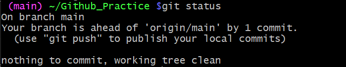

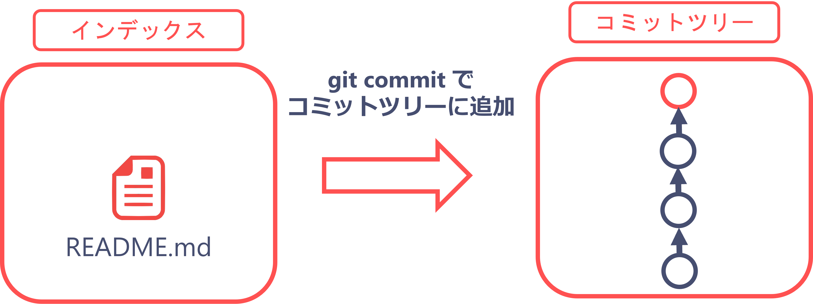


### 2.5 git log

`git log`コマンドは過去のコミット一覧を確認することができます。

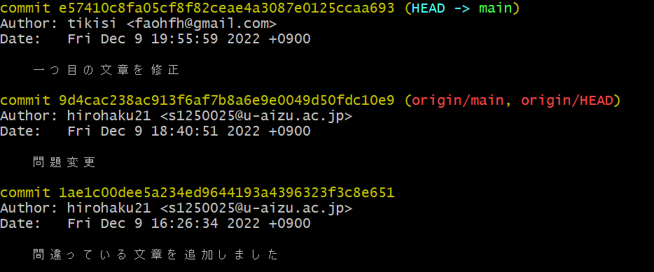

この画面から抜けだせないときは`q`キーを押してください。

`e57410.....`という文字列はこのコミットの識別番号です。次の章で、過去の状態を復元するために使います。


### 2.6 ここまでのまとめ

gitを使ったバージョン管理は、以下の流れで変更をセーブ(commit)できます。
1. ファイルを編集して変更を加える
2. `git add`コマンドで変更をインデックスに登録
3. `git commit`インデックスに登録された変更をコミットツリーに登録してセーブする


### 2.7 追加で練習

1文目と同じように、2文目の間違いも修正してみましょう。

```txt
(変更前) 2. その選手は、十年に一人の玄人だと言われている。
(変更後) 2. その選手は、十年に一人の逸材だと言われている。
```

```bash
テキストエディタで修正
git add README.md
git commit -m "2つ目の文章を修正"
```

`git log`で確認するとコミットが増えていることが確認できると思います。
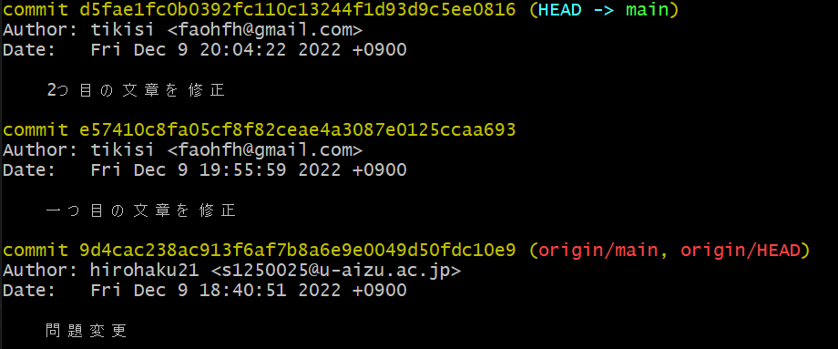


### 2.8 補足

#### git diff
最新のコミットと現在のワーキングツリーを比較してどんな変更が加わったのか確認することができます。
変更後、addする前に`git diff`コマンドで変更箇所を確認できます。

```bash
git diff
```

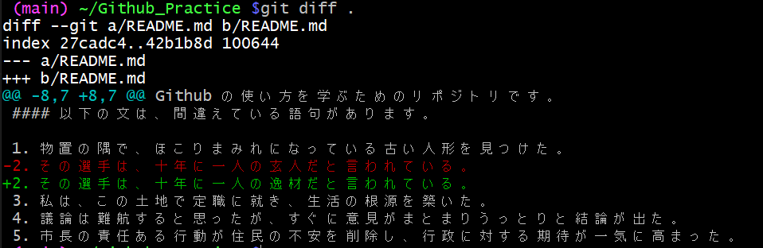

追加された行は+で表示されます。対して、削除された行があった場合は-で表示されます。


## 3. 過去のバージョンに戻す

ここまでにコミットによって２つの変更をセーブしてきました。

この章では、バージョン管理をする理由である過去のバージョンに戻すということをやっていきます。

今回は二個目の変更を適用する前の状態に戻していきます。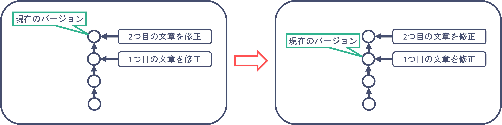


### 3.1 戻したい過去のバージョンを特定する

1. `git log`コマンドを入力すると、過去のコミット一覧を見ることができます。
2. 一個目の変更の時の`e57410c....`をコピーしてください。
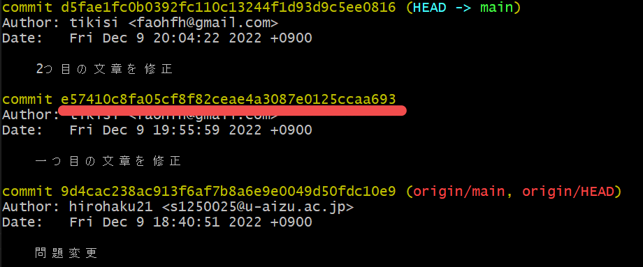

この値をコミットハッシュといい、そのときのバージョンを指定するための値です。
この値は人それぞれ異なるので、↑の画像と一致するとは限らないことに注意してください。

### 3.2 git checkout で過去のバージョンに移動する
`git checkout`コマンドで過去のバージョンに戻ることができます。

先ほどコピーしたコミットハッシュを使って`git checkout`コマンドを実行します。
```bash
git checkout コピーしたコミットハッシュ
```

つづいて、ファイルの中身をテキストエディタで開いて確認してみましょう。
二つ目の変更が適用される前の状態になっていると思います。

二つ目の変更を適用した状態に戻すときは、以下のコマンドで戻ることができます。
```bash
git checkout main
```


## 4. GitHubへの変更の反映

ここまで行った変更とコミットは、あくまで自身のコンピュータ内で完結しています。

この章では、これらの変更をGitHub上のリモートリポジトリに反映してみましょう。

#### 2022/12/10の参加者向け

鍵の登録完了後、前半のパートをHTTPSで設定してしまったため、本来設定したいSSHでの通信設定に切り替えます。

1. コピー後のリポジトリで`<>Code`ボタンを押します

2. SSHを選択します

3. リンクをコピーしてください。
   

4. `ls`コマンドで`README.md`が存在することを確認してください

   1. ない場合は、`cd`コマンドで`README.md`がいるディレクトリに移動してください。

5. 以下のコマンドを入力してください

   ```bash
   git remote set-url origin コピーしたリンク
   ```


### 4.2 git pushでの反映

`git push`コマンドでこれまでの変更をGitHub上のリモートリポジトリに反映できます。

1. `git push`コマンドを実行
    ```bash
    git push
    ```
2. ブラウザ上でリモートリポジトリを開くと変更が反映されていることが確認できます。
    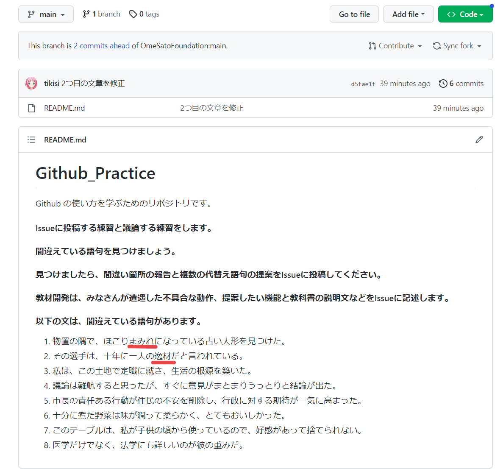


## 5. まとめ
今回は、一人でのバージョン管理に焦点を当てて取り組んでもらいました。

基本的な流れとしては、

1. ファイルを編集して変更をする
2. add & commitで変更を保存する
3. pushで変更をGitHubに適用する

これらを繰り返して開発をしていきます。


今回は文章の1つめと2つめのみを変更したので、他の文章も変更することで練習してみてください。

次回は、複数人開発でのgit利用に焦点を当てて解説したいと思います。
