# 第2回 教材開発講座(前半)
前回はgitを使いバージョンをコミットとして保存、また特定のコミットの状態に復元する方法をやりました。
今回は複数人で開発する際に利用するものとして、ブランチという機能を扱います。


[後半はこちら](./ex02.html)

## 目次

1. [題材](#1.-題材)
2. [準備](#2.-準備)
3. [add&commitの復習](#3.-add&commitの復習)
4. [ブランチ](#4.-ブランチ)
5. [マージ](#5.-マージ)

## 1. 題材

今回は電卓のプログラムをHSPで作っていきます。
この開発をgit使って管理することで、複数人での開発の流れを体験してもらいます。

電卓の機能
1. それぞれの入力ボックスに数値と演算子を入力する
2. 計算ボタンを押すと計算結果が表示される

対応する演算子
- `+`: 足し算
- `-`: 引き算
- `*`: 掛け算
- `/`: 割り算
- `\`: 剰余算(あまり)

<div style="text-align: center;">
    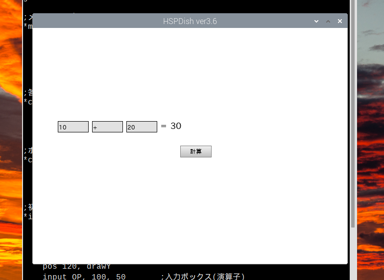
</div>


## 2. 準備
### 1.1 fork
今回の演習用として用意したソースコードが置かれているリポジトリを、みなさんのアカウントの管理するリポジトリとしてコピー(fork)します。  

1. [演習用リポジトリ](https://github.com/OmeSatoFoundation/git_practice_02)を開いてください。
2. `Fork`と書かれた場所をクリックします。
    <div style="text-align: center;">
        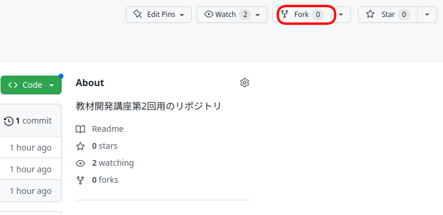
    </div>
3. `Create a new fork`をクリックします。
    <div style="text-align: center;">
        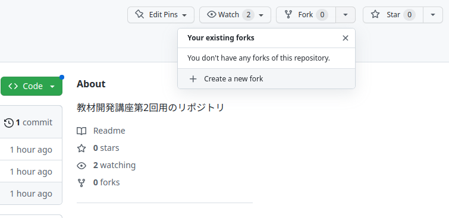
    </div>
4. `Create fork`をクリックします。
    <div style="text-align: center;">
        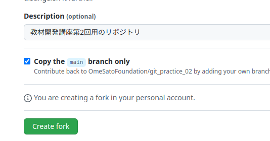
    </div>

### 1.2 鍵の登録
設定がまだの人は、第1回の1.2章を参照してラズパイでも設定してください。
**リンクを貼る**

### 1.3 git clone
git cloneして、ラズパイ上にソースコードを持ってきます。
1. 緑色のcloneボタンを押します。(この時、左上の名前が自身のアカウント名と一致しているか確認してください。)
    <div style="text-align: center;">
        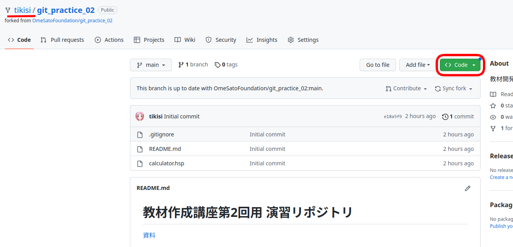
        <p></p>
    </div>
2. 赤枠で囲ったボタンをクリックしてリンクをコピーします。
    <div style="text-align: center;">
        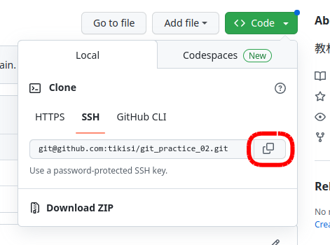
        <p></p>
    </div>
3. ラズパイでターミナルを開きます。
4. ターミナルで以下のコマンドを入力してcloneします。
    ```bash
    git clone コピーしたもの
    ```

### 1.4 git config
GitHubに登録したユーザー名とメールアドレスを設定します。
```bash
git config --global user.name 名前
git config --global user.email メールアドレス
```

`cd`でクローンしてきたリポジトリに移動してから、以下の設定もしてください。
```
cd git_practice_02
git config --local --add merge.ff false
```

## 3. add&commitの復習
### 3.1 最初の状態を確認
hspエディタを使ってgit cloneしてきたディレクトリ中の`calculator.hsp`を開いて、F5キーで実行してみましょう。
以下のように入力ボックスに入力し、計算ボタンを押しても計算結果は0のままだと思います。(まだ計算処理を実装していないからです。)

<div style="text-align: center;">
    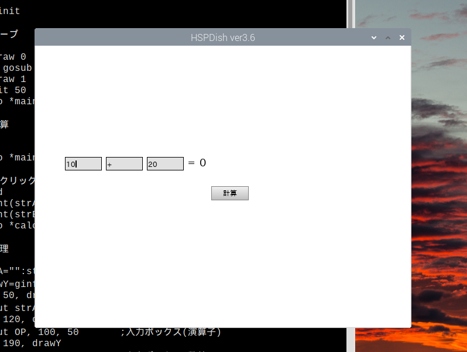
    <p></p>
</div>

### 3.2 足し算の実装
まずは、足し算ができるように処理を書いていきましょう。
`答えの計算`とコメントが書いてあるラベル部分に計算する処理を書いていきます。

```
#include "hsp3dish.as"

gosub *init

;メインループ
*main
    redraw 0
        gosub *draw
    redraw 1
    await 50
    goto *main

;答えの計算
*calc

    goto *main

;ボタンがクリックされたとき
*clicked
```

足し算は以下のように追記すると実装できます。
```
;答えの計算
*calc
    if OP="+" : ans=A+B   ;足し算

    goto *main
```
電卓画面の入力ボックスに入力された値は、左から順に変数`A`, `OP`, `B`に格納されています。
追記した処理では、もし真ん中で`+`と入力されていたら、残りの入力ボックスの入力された値を足し、答えの格納先である変数`ans`に格納します。

<div style="text-align: center;">
    
    <p></p>
</div>

### 3.3 add & commit
足し算の機能について実装することができたので、commitとして今のバージョンを保存しましょう。
```bash
git add calculato.hsp
git commit -m "足し算を実装"
```

commitできたら、`git log`でcommitがあることを確認してみましょう。
<div style="text-align: center;">
    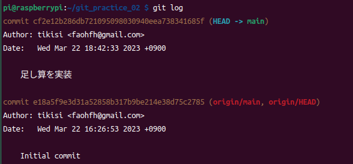
    <p></p>
</div>


**おさらい**
- git status 現在の状態を確認
- git diff 変更部分を確認

## 4. ブランチ
**ブランチの解説をスライドでする**
ブランチとは並列して作業ができるように、ワーキングツリーとコミットツリーをコピーして別の作業空間を用意する機能です。

### 4.1 git branch ~ブランチのリストを確認する~
`git branch`コマンドで存在するブランチの一覧が確認できます。
<div style="text-align: center;">
    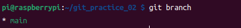
    <p></p>
</div>


まだブランチを追加していないので最初のブランチである`main`ブランチのみ表示されます。  
また、現在のブランチの先頭に`*`マークが表示されます。

### 4.2 git branch ~ブランチの作成~
`git branch ブランチ名`でブランチ名を指定すると新しいブランチを作成することができます。
今回は、引き算の機能を実装するようにブランチを作りたいので、`feature-sub`という名前のブランチを作成します。
```bash
git branch feature-sub
```

`git branch`コマンドで確認するとfeature-subブランチが追加されています。
<div style="text-align: center;">
    
    <p></p>
</div>

### 4.3 git switch 
`git switch ブランチ名`で見ているブランチを切り替えることができます。
```bash
git switch feature-sub
```
`git branch`コマンドで確認すると現在のブランチを表す`*`がfeature-subの前に表示されます。
<div style="text-align: center;">
    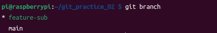
</div>

### 4.4 引き算の実装
引き算の機能を追加します。
```
;答えの計算
*calc
    if OP="+" : ans=A+B   ;足し算
    if OP="-" : ans=A-B   ;引き算

    goto *main
```

add, commitします。
```bash
git add calculator.hsp
git commit -m "引き算を実装"
```

### 4.5 ブランチの切り替え(mainとfeature-sub)
ここで一旦、`main`ブランチに戻ってみましょう
```bash
git switch main
```

再度、hspエディタで開くと
```
;答えの計算
*calc
    if OP="+" : ans=A+B   ;足し算

    goto *main
```
引き算の機能が実装される前の状態だと思います。

これは、引き算の機能が`feature-sub`ブランチに実装されているだけで、`main`ブランチにはまだ適用されていないためです。
<div style="text-align: center;">
    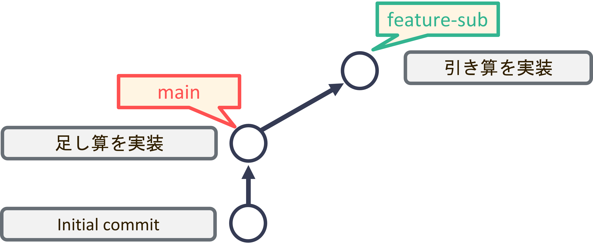
</div>

### 4.6 練習(掛け算の実装)
練習として引き算と同様、新たにブランチを作成して掛け算の機能を実装してみましょう。
ブランチ名は`feature-mul`とします。

<details>
    <summary>答え</summary>
	<div>
    	<pre><code><div>
		git branch feature-mul    #ブランチの作成
		git switch feature-mul    #ブランチの切り替え
		</div></code></pre>
		掛け算の実装
		<pre><code><div>
		;答えの計算
		*calc
            if OP="+" : ans=A+B   ;足し算
            if OP="*" : ans=A-B   ;掛け算
            <br>
            goto *main
        </div></code></pre>
        add, commit
        <pre><code><div>
        git add calculator.hsp
        git commit -m "掛け算を実装"
        </div></code></pre>
    </div>
</details>


## 5. マージ
現状のブランチの状態は以下のようになっています。
<div style="text-align: center;">
    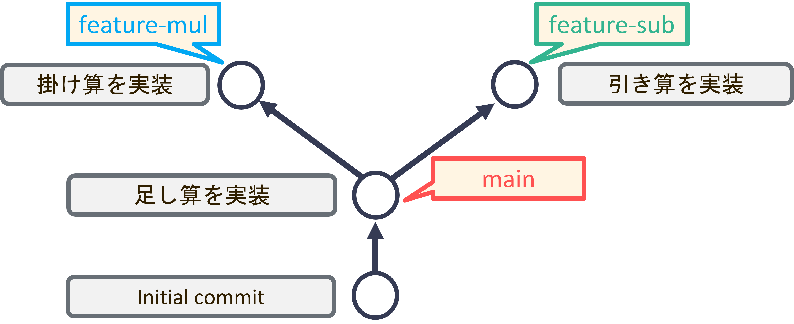
</div>
このセクションでは、本流である`main`ブランチに`feature-sub`ブランチと`feature-mul`ブランチそれぞれで実装した内容を結合(マージ)します。

### 5.1. 引き算のマージ
まずは、`feature-sub`ブランチでの変更を`main`ブランチに結合させます。
`git merge ブランチ名`でブランチ名で指定したブランチをマージすることができます。

```bash
git swithc main
git branch # mainブランチにいることを確認してください
git merge feature-sub
```

hspエディタで`calculator.hsp`を開くと引き算の実装が追加されています。
<div style="text-align: center;">
    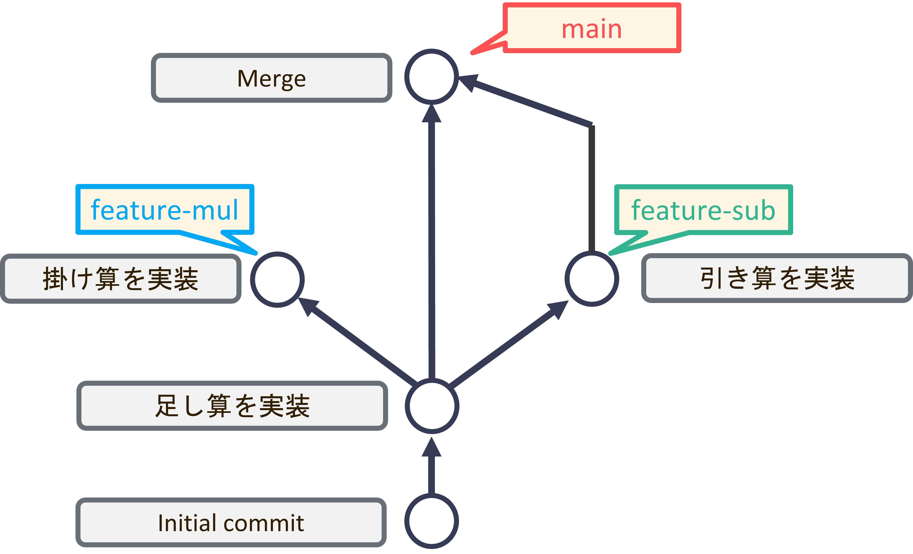
</div>


#### 5.2. git log --graph
`--graph`オプションをつけることでブランチの分岐・統合の変遷を見ることができます。
```bash
git log --graph
```

<div style="text-align: center;">
    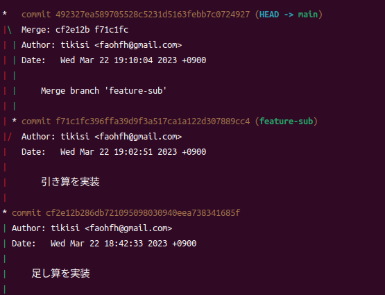
    <p></p>
</div>

### 5.3. 掛け算のマージ
続いて、`feature-mul`ブランチを`main`ブランチにマージしてみましょう。
```
git merge feature-mul
```
ターミナルにCONFLICTというメッセージが表示されたと思います。

<div style="text-align: center;">
    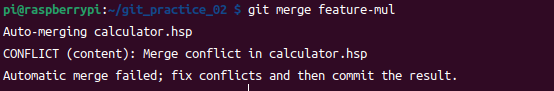
    <p></p>
</div>

これは、gitで自動的にマージすることができなかったことを示しています。
このように自動的にマージができないことを**コンフリクト**といいます。

### 5.4 コンフリクト
今回のマージの状況について、詳しく見ていきましょう。
まず、ここまでのブランチとコミットは下図のようになっています。
各コミットにA,B,Cという名前をつけます。
<div style="text-align: center;">
    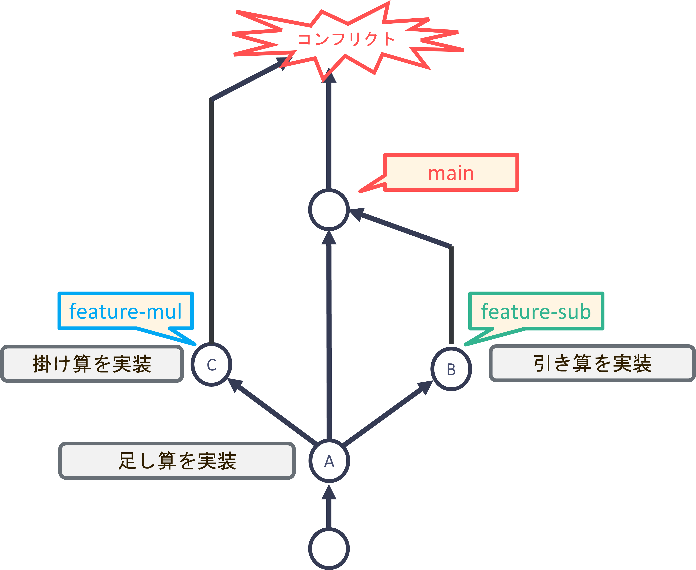
</div>

親であるAは
<div style="text-align: center;">
    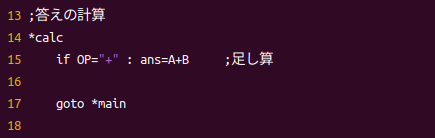
    <p>A</p>
</div>

B, Cを比較すると  
<div style="text-align: center;">
    <div style="display:inline-block">
        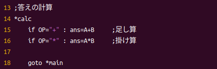
        <p>C</p>
    </div>
    <div style="display:inline-block">
    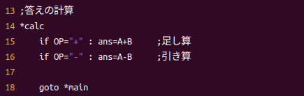
    <p>B</p>
    </div>
</div>
同じ行を編集しています。  

マージする際に同じ箇所が変更されていると、gitはどちらの変更を採用したら良いのか判断がつきません。  
gitはコンフリクトを発生させて、プログラマに判断を委ねます。

### 5.5 コンフリクトの解決
`calculator.hsp`を開いてみましょう。  
ソースコードのどの箇所が原因でコンフリクトが発生したのかが書かれています。  
<div style="text-align: center;">
    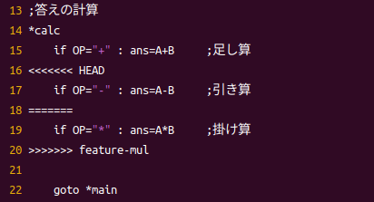
    <p></p>
</div>

HEADは現在いるブランチ(main)の最新のコミットを表しているので、  
<<<<<<< HEAD 〜 ======= はBの状態  
======= 〜 >>>>>>>>> はCの状態が書かれています。  

このファイルを意図する状態になるよう編集しましょう。
<div style="text-align: center;">
    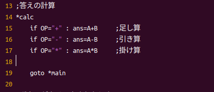
    <p></p>
</div>


コンフリクトを直した後は、add, commitが必要です。
```bash
git add calculator.hsp
git commit -m "コンフリクト解消"
```

logコマンドで確認すると以下のようになっていると思います。
<div style="text-align: center;">
    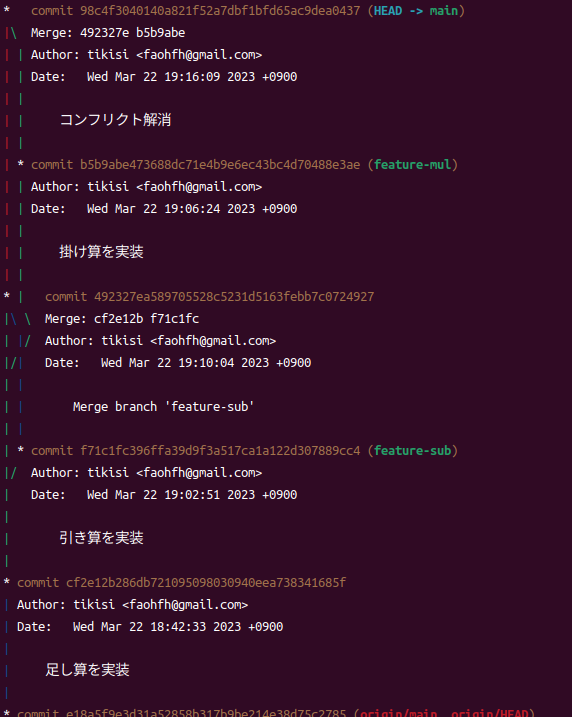
    <p></p>
</div>


最後にここまでの内容をpushしましょう
```bash
git push origin main
```