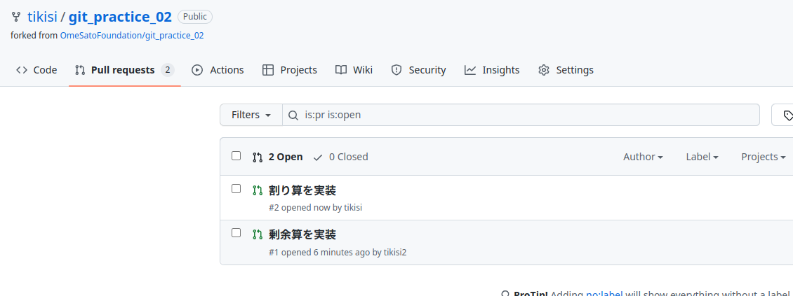

# 第2回 教材開発講座(後半)
後半では2人1組で進めていきます。
ここでは、1人目をAさん、2人目をBさんと呼称することにします。

未実装である以下の2つの機能をそれぞれの人が各自のブランチで実装します。
その後、互いの変更をGitHubを介してマージしてみましょう。

- Aさん: `/` 割り算
- Bさん: `\` 剰余算(あまり)


[前半はこちら](./ex01.html)

## 目次

6. [準備](#6.-準備)
7. [実装](#7.-実装)
8. [プルリクエストの作成](#8.-プルリクエストの作成)
9. [プルリクエストの確認](#9.-プルリクエストの確認)
10. [プルリクエストのマージ](#10.-プルリクエストのマージ)
11. [最終バージョンの確認](#11.-最終バージョンの確認)

## 6. 準備
前半では各人がforkしたリポジトリを保有し、その上で作業をしました。
後半ではAさんのリポジトリに対して、AさんとBさんが作業をする形にしましょう。

### 6.1 リポジトリへの招待(Aさん)
Aさんは、自身のリポジトリに対してBさんが変更を加えることができるようにBさんを招待しましょう。

1. **Settings>Collaborators>Add people**ボタンをクリック  
    このとき、ページ上の左上の名前が`自身の名前/git_practice_02`になっていることを確認してください。
    
    <div style="text-align: center;">
        
    </div>
2. Bさんのユーザー名またはメールアドレスを入力して招待します。
    <div style="text-align: center;">
        
    </div>

### 6.2 リポジトリへの参加(Bさん)
Aさんからの招待がGithubで登録しているメールアドレス宛に届いていると思うので、確認してみてください。
1. 届いたメールのview invitationをクリック
    <div style="text-align: center;">
        
    </div>
2. Accept invitationをクリックして招待を承認
    <div style="text-align: center;">
        
    </div>
3. ラズパイの`git_practice_02`フォルダをリネームもしくは削除  
    Aさんのリポジトリをクローンするので、名前が被らないようにしましょう。
    ```bash
    rm -rf git_practice_02
    mv git_practice_02 好きな名前
    ```
4. Aさんのリポジトリをcloneするリンクをコピー  
    このとき、ページ上の左上の名前が`Aさんの名前/git_practice_02`になっていることを確認してください。
    <div style="text-align: center;">
        
    </div>
5. ラズパイ上でclone
    ```bash
    git clone コピーしたリンク
    ```

## 7. 実装
それぞれ、担当する機能をブランチを分けて実装しましょう。

||担当者|ブランチ名|機能の詳細|追加するコード|備考|
|:--:|:--:|:--:|:--:|:--:|:--:|
|割り算|A|`feature-div`|`/`で割り算|`if OP="/" : ans=A/B`||
|剰余算<br>(あまり)|B|`feature-rem`|`\`で剰余算|`if OP="\\" : ans=A\B`|""の中では`\`ではなく`\\`としてください|

動作確認できたら、add, commitもしてください。

## 8. プルリクエストの作成
変更を行った場合、他の人にその変更が正しいかチェックをしてもらう必要があります。  
ここでは、プルリクエストというGitHubの機能を使ってペアの人に変更をチェックしてもらいましょう。

1. `7`で行った変更をGitHubに反映する
    ```bash
    git push origin 変更を行ったブランチ名
    ```
2. GitHub上で`Compare & pull request`ボタンをクリック
    <div style="text-align: center;">
        
    </div>
3. マージ先のブランチを`Aさんの名前/git_practice_02`の`main`ブランチに変更
    <div style="text-align: center;">
        
    </div>
4. タイトルと説明文を書いてから`Create pull request`ボタンをクリック
    <div style="text-align: center;">
        
    </div>
    

## 9. プルリクエストの確認
ペアの人が作ったプルリクエスト内の変更に問題がないかチェックをしましょう。

1. ペアの人のプルリクエストを見つける  
    `Pull requests`から現在存在するプルリクエストの一覧を確認できます。
    <div style="text-align: center;">
        
    </div>
2. ペアの人のプルリクエストを開いてみましょう  
    `Commits`や`File Changes`からそのプルリクエストに含まれるコミットや変更の一覧が確認できます。
    <div style="text-align: center;">
        
    </div>
3. ラズパイ上でペアの人の変更の動作確認
    上の画面の``commit into main form feature-rem`のように、from以降の部分がそのプルリクエストのブランチです。
    ラズパイ上でこのブランチに切り替えてみましょう
    ```bash
    git fetch origin    #GitHub上での変更を取得
    git switch 確認したいブランチ
    ```
4. HSPエディタで起動して動作確認をしてみてください。

### 9.1 問題があった場合
プルリクエストに対してコメントを書いて、ペアの人に教えてあげてください。
<div style="text-align: center;">
    
</div>

問題を報告された側の人は、コメントを書いて議論するもしくは修正を加えてください。
修正後、再度add, commit, pushをするとその修正がGitHub上に反映できます。

## 10. プルリクエストのマージ
ペアの人のプルリクエストの確認をして問題がなかったら、確認者はそのプルリクエストを`main`ブランチにマージしましょう。
ここでは、2種類のマージの仕方を紹介します。(好きな方で行ってください。)

### 10.1 ブラウザ上でマージ
GitHubから対象のプルリクエストを開いて`Merge pull request`ボタンを押し、`confirm`を押したら完了です。
<div style="text-align: center;">
    
</div>

### 10.2 コマンドからマージ
基本的には前半でマージしたのと同じ方法です。
```bash
git switch main
git merge 対象のブランチ
git push origin main    # リモートリポジトリにマージしたことを反映
```

### 10.3 コンフリクトが発生したとき
マージするのが後になった側の人はコンフリクトが発生するかもしれません。
コンフリクトが発生した場合は、解消してからマージしましょう。

#### ブラウザからマージする場合
1. ブラウザからマージする場合には、`Merge pull request`ボタンが押せなくなりコンフリクトが発生することを教えてくれます。
    <div style="text-align: center;">
        
    </div>
2. `Resolve conflicts`ボタンからファイルの変更が可能です。
3.  ブラウザ上のエディタでコンフリクト部分を修正します。
    <div style="text-align: center;">
        
    </div>
4. `Marked as resolved` > `commit merge`ボタンをクリックします。
    <div style="text-align: center;">
        
    </div>
    <div style="text-align: center;">
        
    </div>
5. `Merge pull request`ボタンが押せるようになっているので、クリック後に`confirm`を押したらマージ完了です。
    <div style="text-align: center;">
        
    </div>


#### コマンドからマージする場合
コマンドからマージしている場合は、前半と基本的に同じです。
1. コンフリクトした部分を修正
2. add & commit
    ```bash
    git add calculator.hsp
    git commit -m "コンフリクト解消"
    ```
3. リモートリポジトリにマージしたことを反映
    ```bash
    git push origin main
    ```

## 11. 最終バージョンの確認
お互いにプルリクエストを`main`ブランチにマージしました。
ラズパイ上で最終バージョンを確認してみましょう。

```bash
git switch main
git pull origin main    # リモートリポジトリの変更をローカルに適用
```